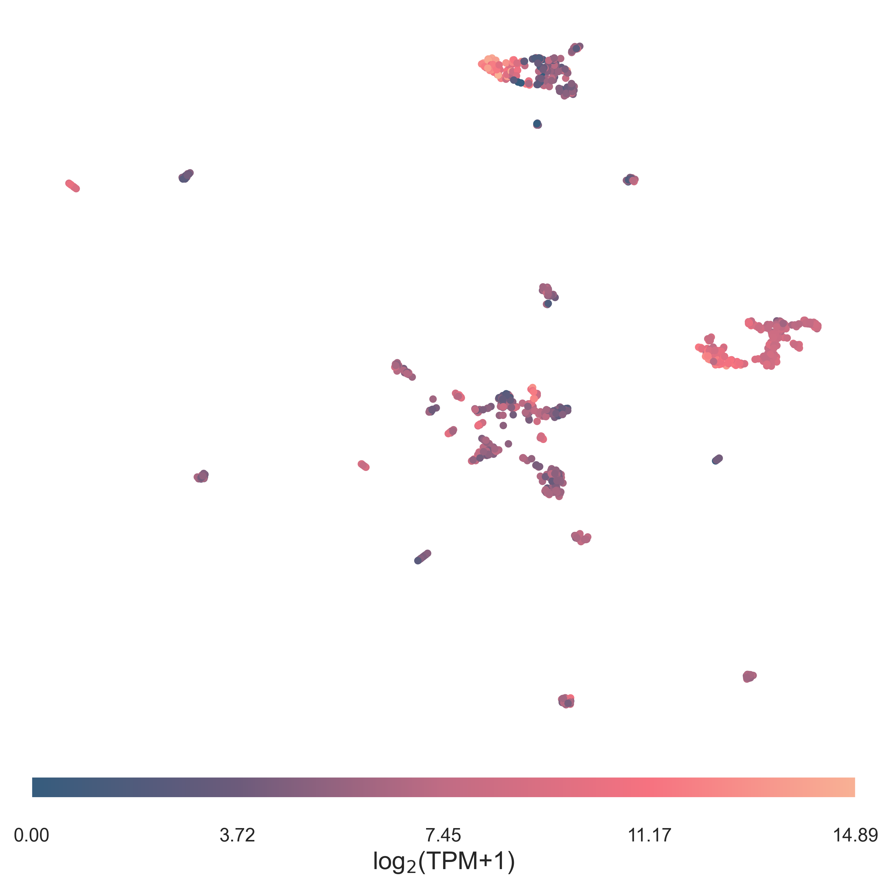

=================
Statistical Tests
=================

the :code:`multicompare` function can run repeated statistical test
across a features (genes). It requires to select a list of :code:`groups`
to be compared, and a one-hot-encoded matrix with groups :code:`membership`.
If only two groups are provided, Mann-Whitney U test [Mann1947]_ will be run,
if more, a Kruskal-Wallis H test [Kruskal1952]_ will be used instead.
A :code:`data` dataframe matrix containing the values to compare (e.g.
TMM-normalized counts obtained with :code:`edger.build_dgelist`) needs to 
be provided. 

The output genes can be filtered through a p-value :code:`cutoff`, while 
further flags like which method to use (:code:`multi_method`) and the 
:math:`{\alpha}` (:code:`multi_alpha`) can be provided
for the multiple testing correction.

.. code-block:: python

  from tapyra.stats import multicompare

  stats, dunn = multicompare(groups, membership, data, 
        cutoff=1, multi_method='fdr_tsbh', multi_alpha=0.05)

In output is a dataframe with median values, ratio, difference
and p-values for each provided genes.
If Kruskal-Wallis was selected, the Dunn post-hoc test [Dunn1961]_ results are also
provided.

Contingency tables
==================

Contingency tables can be built and related tests can be run with TAPIR.

.. code-block:: python

  form tapyra.stats import get_contingency, test_contingency

  contab = get_contingency(series, groups, membership)
  stats  = test_contingency(contab, method='auto')
  

The :code:`get_contingency` function requires a :code:`series` containing
the variable to evaluate (e.g. sex, therapy status, mutation), 
the :code:`groups` to compare and the one-hot-encoded :code:`membership` table.
The significance of the resulting table can be then measured with :code:`test_contingency`.
This will automatically select between Fisher exact test [Fisher1992]_ if a 2x2 matrix is provided
or a :math:`{\chi^2}` test [Pearson1900]_ otherwise, but each :code:`method` can be manually chosen.
If the :math:`{\chi^2}` test is selected and insufficient populations are provided,
the function will throw a warning and return :code:`None`.

Survival lines
==============

Survival analysis is available through lifelines. For now, 
only Kaplan-Meier fitted curves, and log-ratio are available.

The survival data (:code:`st_stats`) needs to be formatted as a pandas dataframe
with the time value in :code:`survival_times` and a binary death event 
observation in :code:`event_observed`.

As for other functions, a list of :code:`groups`
to be compared needs to be provided, together with 
a one-hot-encoded matrix with groups :code:`membership`.

.. code-block:: python

  from tapyra.stats import st_curves
  from tapyra.plotting import plot_survival

  stats, curves = st_curves(st_stats, groups, membership)
  plot_survival(curves, xlab='Years', ylab='OST', save_file='./plot.png')

The resulting p-value can be found in :code:`stats`, while :code:`curves` 
can be plotted with :code:`plot_survival`. 

Dimensionality reduction
========================

TAPIR provides a quick interface for dimensionality reduction with umap 
and plotting its results.
:code:`get_umap` only takes the data to be mapped (e.g. expression counts),
with samples as rows and features as columns. The :code:`var_drop_thresh` cutoff
can be provided for low variance removal. The most variant genes whose 
variance sum up to the given threshold percentage will be kept.
Alternatively :code:`collinear_thresh` collinearity can be removed by
providing a correlation threshold, albeit the current implementation is 
particularly slow and not recommended.
UMAP will be run with preselected settings, but these can be adjusted
by providing the appropriate UMAP object keywords.

.. code-block:: python

  from tapyra.embedding import get_umap
  from tapyra.plotting import plot_clusters

  proj, mappa = get_umap(data, collinear_thresh=None, var_drop_thresh=.99)
  proj.index  = data.index

  plot_clusters(proj, groups=None, values=data['MYCN'], clab='log$_2$(TPM+1)',save_file='./map.png')

Continuous :code:`values` can be provided as colormap when plotting.
Alternatively if a list of :code:`groups` is provided, the datapoints will be coloured 
accordingly. 

Other plots
===========

The expression values or gene set enrichment scores
can be plotted as distributions using 
:code:`plot_distribution`. Groups and membership table need to be provided.
This function allows to plot on one (:code:`genes_up`) or two levels 
(if :code:`genes_dw` is also provided) for an easy comparison.

.. code-block:: python

  from tapyra.plotting import plot_distribution

  plot_distribution(data, groups, membership, 
    genes_up, genes_dw,
    save_file='./distribution.png')

.. image:: figs/dist.png
	:width: 300px

Similarly, the median values can be plotted as a heatmap
with :code:`plot_heatmap`

.. code-block:: python

  from tapyra.plotting import plot_heatmap

  plot_heatmap(data, groups, membership, genes, 
    clab='log$_2$(TPM+1)', 
    save_file='./heatmap.png')

Labels and color map range can be customized to a degree.
For the full list of available options and their use, see :ref:`api`.

References
----------
        
.. [Mann1947] Mann, H. B., Whitney, D. R. (1947). "On a Test of Whether one of Two Random Variables is Stochastically Larger than the Other", Annals of Mathematical Statistics. 18 (1): 50–60.
.. [Kruskal1952] Kruskal W. H., Wallis  W. A. (1952). "Use of ranks in one-criterion variance analysis", Journal of the American Statistical Association. 47 (260): 583–621.
.. [Dunn1961] Dunn O. J. (1961). "Multiple Comparisons among Means", Journal of the American Statistical Association, 56:293, 52-64.
.. [Fisher1992] Fisher R. A. (1992). "Statistical Methods for Research Workers", In: Kotz S., Johnson N.L. (eds) "Breakthroughs in Statistics". Springer Series in Statistics (Perspectives in Statistics). Springer, New York, NY.
.. [Pearson1900] Pearson, K. (1900). "On the criterion that a given system of deviations from the probable in the case of a correlated system of variables is such that it can be reasonably supposed to have arisen from random sampling", The London, Edinburgh, and Dublin Philosophical Magazine and Journal of Science, 50(302), 157–175.